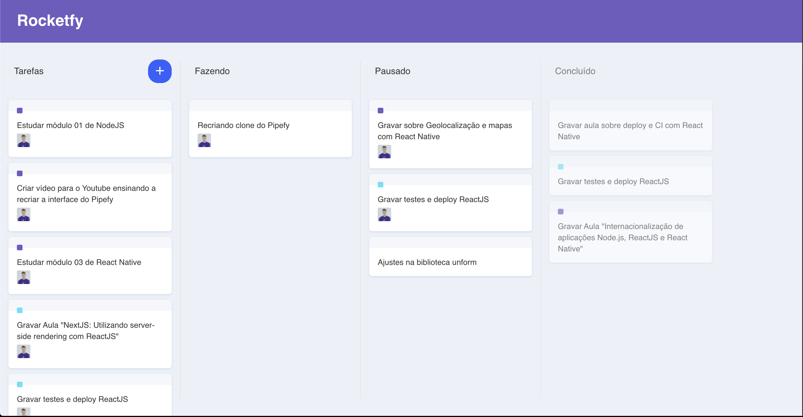

# Rocketfy (Pipefy Clone)
:camera: UIClone of Pipefy using React.js and Typescript. Implementation of drag n'drop using react-dnd.



### Running Locally
```sh
# Install dependencies
yarn install

# Start the app on a new window
yarn start
```

## :memo: License

This project is under the MIT license. See the [LICENSE](https://github.com/gustavohassen/gobarber-api/blob/master/LICENCE)

Made by Gustavo Hassen dos Santos [Linkedin](https://www.linkedin.com/in/gustavo-hassen-dos-santos/)
